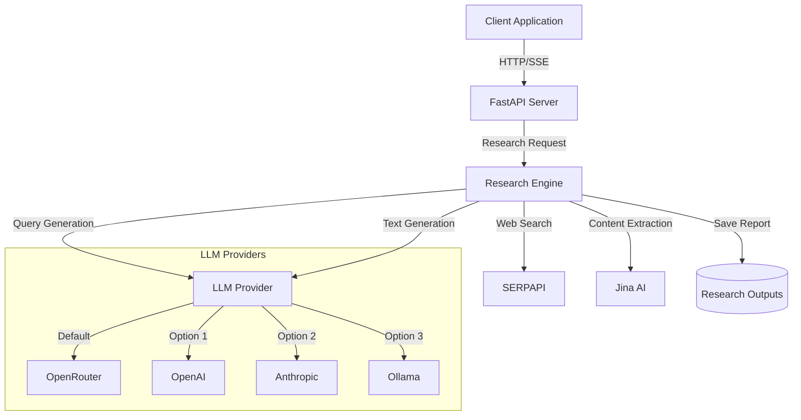
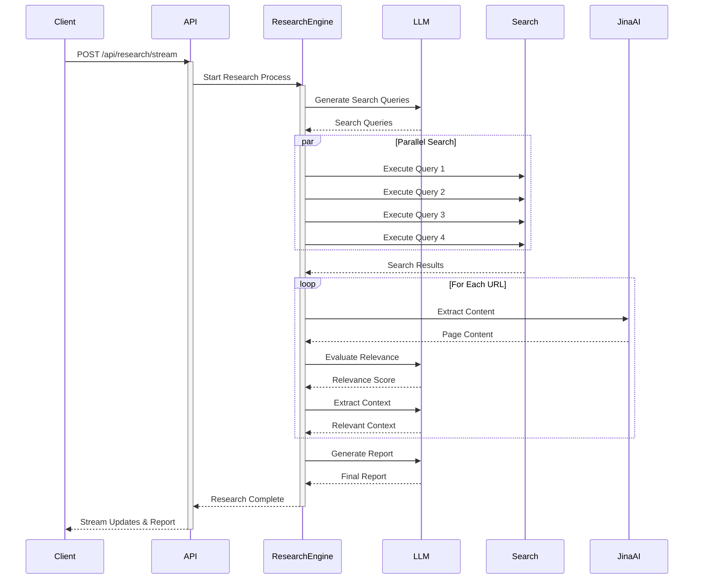
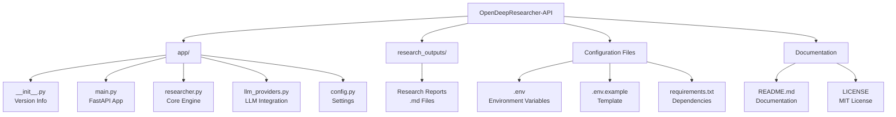
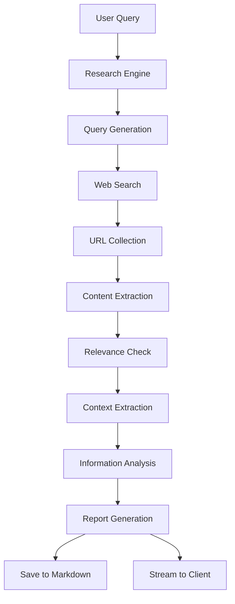

# OpenDeepResearcher-API

A REST API service for conducting deep research on any topic using AI. This project is an adaptation of Justin Pinkney's research notebook into a modular API service.

## Overview

OpenDeepResearcher-API is a research assistant that:
- Generates intelligent search queries
- Performs parallel web searches
- Evaluates content relevance
- Extracts key information
- Synthesizes findings into comprehensive reports
- Provides real-time status updates during research

### System Architecture



### Research Process Flow



## Features

- **Multiple LLM Provider Support**:
  - OpenRouter (default)
  - OpenAI
  - Anthropic
  - Ollama (local)
- **Intelligent Query Generation**: Creates targeted search queries to explore different aspects of your topic
- **Parallel Web Search**: Uses SERPAPI for efficient web searching
- **Content Processing**: Uses Jina AI for webpage content extraction
- **Automated Research Process**: Iteratively explores topics until sufficient information is gathered
- **Real-time Status Updates**: Streams research progress using Server-Sent Events (SSE)
- **Markdown Report Generation**: Saves research findings with full process logs

## Installation

1. Clone the repository:
```bash
git clone https://github.com/yourusername/OpenDeepResearcher-API.git
cd OpenDeepResearcher-API
```

2. Create a Python virtual environment:
```bash
python -m venv venv-odr-310
source venv-odr-310/bin/activate  # On Unix/macOS
# or
.\venv-odr-310\Scripts\activate  # On Windows
```

3. Install dependencies:
```bash
pip install -r requirements.txt
```

## Configuration

1. Copy the example environment file:
```bash
cp .env.example .env
```

2. Configure your environment variables in `.env`:

```env
# Required API Keys
SERPAPI_API_KEY=your_serpapi_key
JINA_API_KEY=your_jina_key

# LLM Provider (choose one)
LLM_PROVIDER=openrouter  # Options: openrouter, openai, anthropic, ollama

# Provider-specific API Keys (only needed for chosen provider)
OPENROUTER_API_KEY=your_openrouter_key
OPENAI_API_KEY=your_openai_key
ANTHROPIC_API_KEY=your_anthropic_key

# Ollama Settings (only needed if using ollama)
OLLAMA_HOST=http://localhost:11434  # Default Ollama host
OLLAMA_MODEL=llama2  # Default model
```

## Usage

1. Start the API server:
```bash
uvicorn app.main:app --reload
```

2. The API will be available at `http://localhost:8000`

3. API Endpoints:
   - POST `/api/research`: Traditional synchronous research endpoint
   - POST `/api/research/stream`: Stream research progress in real-time using SSE
   - GET `/api/health`: Check API health

Example research request (traditional):
```bash
curl -X POST http://localhost:8000/api/research \
  -H "Content-Type: application/json" \
  -d '{"query": "Impact of quantum computing on cryptography", "max_iterations": 5}'
```

Example streaming request (real-time updates):
```bash
curl -N -H "Accept: text/event-stream" \
  -H "Content-Type: application/json" \
  -X POST http://localhost:8000/api/research/stream \
  -d '{"query": "Impact of quantum computing on cryptography", "max_iterations": 5}'
```

The streaming endpoint provides real-time updates on:
- Research initialization
- Query generation
- Search execution
- Content processing
- Context extraction
- Report generation
- Final results

### Understanding Stream Updates

The streaming endpoint returns Server-Sent Events (SSE) with the following structure:
```json
data: {
    "type": "<update_type>",
    "message": "<descriptive_message>",
    // Additional data specific to the update type
}
```

Status update types include:
- `start`: Research initialization
- `progress`: General progress updates
- `queries`: Generated search queries
- `iteration`: Start of a new research iteration
- `links`: Number of unique links found
- `processing`: Currently processing URL
- `evaluation`: Content relevance evaluation
- `context`: Extracted relevant context
- `warning`: Processing warnings or issues
- `error`: Error notifications
- `complete`: Final research results

Example stream output:
```json
data: {"type": "start", "message": "Starting research: What are the benefits of meditation?"}

data: {"type": "progress", "message": "Generating initial search queries..."}

data: {
    "type": "queries",
    "message": "Generated initial queries",
    "queries": [
        "benefits of meditation for stress relief",
        "meditation and mental health",
        "how meditation improves focus and productivity",
        "meditation and its impact on anxiety"
    ]
}

data: {"type": "iteration", "message": "=== Iteration 1 ===", "iteration": 1}

data: {"type": "links", "message": "Found 30 unique links", "count": 30}

data: {
    "type": "processing",
    "message": "Processing: https://example.com/article",
    "url": "https://example.com/article"
}

data: {
    "type": "evaluation",
    "message": "Page usefulness: Yes",
    "url": "https://example.com/article",
    "useful": true
}

data: {
    "type": "context",
    "message": "Extracted context (preview): Research shows that meditation...",
    "url": "https://example.com/article"
}

data: {
    "type": "complete",
    "message": "Research completed successfully",
    "report": "Final research report...",
    "logs": ["Log entry 1", "Log entry 2"]
}
```

### Client-side Handling

Example JavaScript code to handle the stream:
```javascript
const eventSource = new EventSource('/api/research/stream');

eventSource.onmessage = (event) => {
    const data = JSON.parse(event.data);
    
    switch(data.type) {
        case 'start':
            console.log('Research started:', data.message);
            break;
        case 'queries':
            console.log('Search queries:', data.queries);
            break;
        case 'links':
            console.log('Found links:', data.count);
            break;
        case 'evaluation':
            console.log('Content evaluation:', data.message, data.useful);
            break;
        case 'complete':
            console.log('Research complete:', data.report);
            eventSource.close();
            break;
        default:
            console.log('Update:', data.message);
    }
};

eventSource.onerror = (error) => {
    console.error('Stream error:', error);
    eventSource.close();
};
```

## LLM Provider Configuration

### OpenRouter (Default)
```env
LLM_PROVIDER=openrouter
OPENROUTER_API_KEY=your_key
OPENROUTER_MODEL=meta-llama/llama-3-8b-instruct:free
```

### OpenAI
```env
LLM_PROVIDER=openai
OPENAI_API_KEY=your_key
OPENAI_MODEL=gpt-3.5-turbo
```

### Anthropic
```env
LLM_PROVIDER=anthropic
ANTHROPIC_API_KEY=your_key
ANTHROPIC_MODEL=claude-3-haiku-20240307
```

### Ollama (Local)
```env
LLM_PROVIDER=ollama
OLLAMA_HOST=http://localhost:11434
OLLAMA_MODEL=llama2
```

## Testing with Ollama Locally

1. Install Ollama:
```bash
# macOS or Linux
curl -fsSL https://ollama.com/install.sh | sh

# Windows
# Download from https://ollama.com/download
```

2. Start the Ollama service:
```bash
ollama serve
```

3. Pull your desired model (e.g., Llama 2):
```bash
ollama pull llama3.2
```

4. Configure your `.env` file for Ollama:
```env
# Required API Keys (still needed for web search and content extraction)
SERPAPI_API_KEY=your_serpapi_key
JINA_API_KEY=your_jina_key

# Set Ollama as the LLM provider
LLM_PROVIDER=ollama

# Ollama Configuration
OLLAMA_HOST=http://localhost:11434
OLLAMA_MODEL=llama2
```

5. Start the API server:
```bash
uvicorn app.main:app --reload
```

6. Test the research endpoint:
```bash
curl -X POST http://localhost:8000/api/research \
  -H "Content-Type: application/json" \
  -d '{"query": "What are the main features of the Llama 2 model?", "max_iterations": 2}'
```

Available Ollama models:
- `llama3.2` - General purpose model
- `mistral` - Powerful open-source model


To use a different model, update `OLLAMA_MODEL` in your `.env` file and ensure you've pulled the model with `ollama pull model_name`.

## Development

### Project Structure



### Data Flow



## Acknowledgments

This project is based on Justin Pinkney's research notebook implementation. The original work has been adapted into a REST API service with additional features like multi-provider LLM support and parallel processing.

## License

This project is licensed under the MIT License - see the LICENSE file for details.

## TODO and Roadmap

### Planned Migrations
1. **Content Extraction** - [In Progress]
   - Migrate from Jina.ai to our own extraction stack
   - See [JINA_MIGRATION.md](docs/JINA_MIGRATION.md) for detailed plan
   - Implement multiple extraction methods (Trafilatura, Newspaper3k, BeautifulSoup)
   - Add content caching for improved performance

2. **Web Search** - [Planned]
   - Migrate from SERPAPI to direct search implementations
   - Support multiple search engines (Google, Bing, DuckDuckGo)
   - Implement rate limiting and proxy rotation
   - Add search result caching

### Feature Enhancements
1. **Response Formatting**
   - Add support for multiple output formats (MD, PDF, HTML)
   - Implement custom templates for research reports
   - Add citation support and bibliography generation
   - Include source credibility scoring

2. **User Interface**
   - Develop a web-based dashboard
   - Add real-time research progress visualization
   - Implement interactive report editing
   - Add source material management

3. **Research Quality**
   - Implement fact-checking against multiple sources
   - Add source credibility scoring
   - Improve context relevance detection
   - Enhance duplicate content detection

4. **Performance Optimizations**
   - Implement distributed processing for large research tasks
   - Add result caching system
   - Optimize memory usage during large operations
   - Improve concurrent request handling

### Infrastructure
1. **Monitoring and Logging**
   - Add detailed performance metrics
   - Implement error tracking and reporting
   - Add system health monitoring
   - Set up automated alerts

2. **Testing**
   - Expand unit test coverage
   - Add integration tests
   - Implement performance benchmarks
   - Add automated quality checks

3. **Documentation**
   - Add API reference documentation
   - Create developer guides
   - Add more code examples
   - Create troubleshooting guides

4. **Deployment**
   - Add Docker support
   - Create Kubernetes configurations
   - Set up CI/CD pipelines
   - Add automated deployment scripts

### Security
1. **Authentication and Authorization**
   - Implement user authentication
   - Add role-based access control
   - Add API key management
   - Implement rate limiting

2. **Data Protection**
   - Add data encryption at rest
   - Implement secure credential storage
   - Add audit logging
   - Implement backup and recovery

### Community Features
1. **Collaboration**
   - Add shared research projects
   - Implement commenting system
   - Add version control for reports
   - Create research templates

2. **Integration**
   - Add webhook support
   - Create plugin system
   - Add export to various platforms
   - Implement sharing features

To contribute to any of these improvements, please check our [CONTRIBUTING.md](docs/CONTRIBUTING.md) guide.
